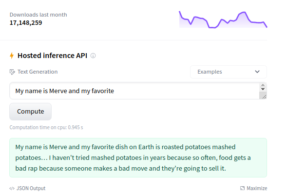
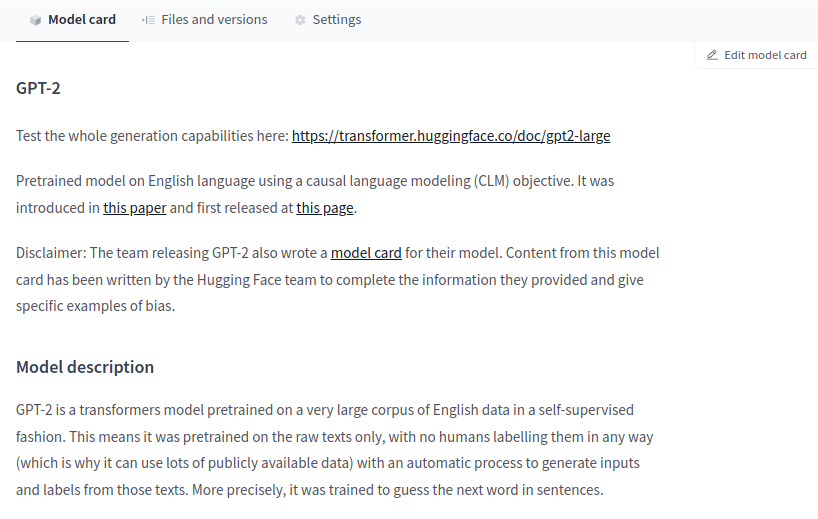
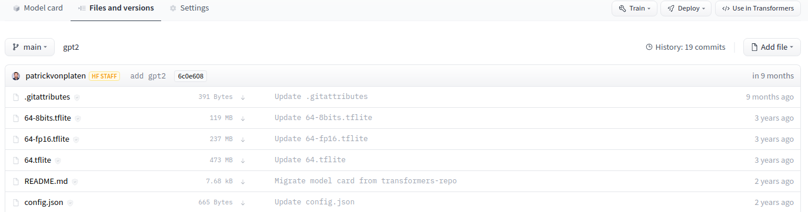
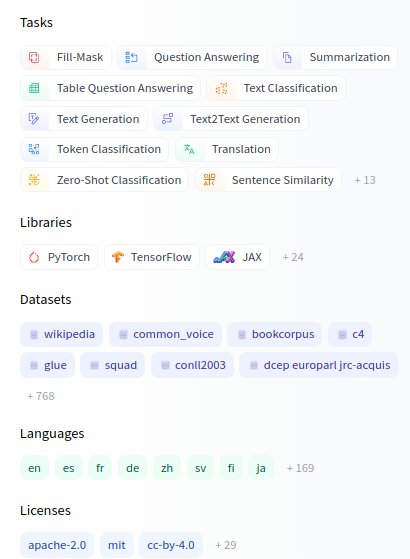
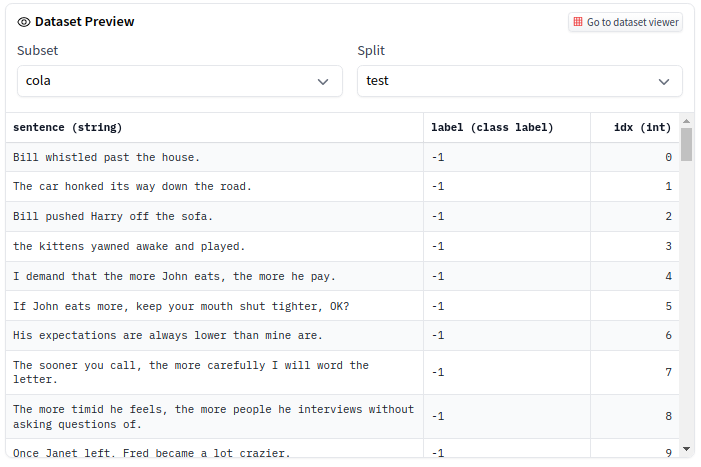
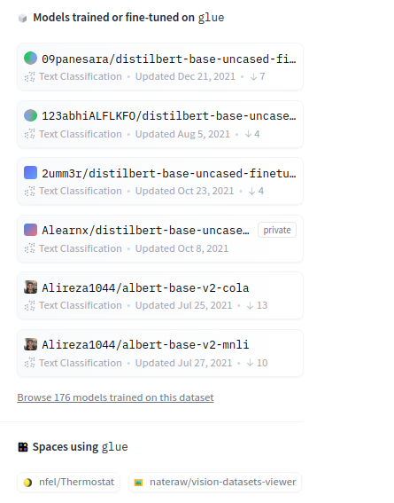

# Workshop: Un tour attraverso l'hub di Hugging Face

<aside>

💡 **Benvenute e benvenuti!**

Abbiamo raccolto un set di strumenti che possono essere usati dagli insegnanti universitari per preparare laboratori o lezioni. Il materiale è auto-contenuto in modo tale che possa essere facilmente inserito in un programma esistente. Il contenuto è **gratuito** e usa tecnologie open-source molto note (`transformers`, `gradio`, etc).

In alternativa, puoi fare richiesta affinche qualcuno del team di Hugging Face svolga i tutorial all'interno del tuo corso tramite le iniziative di [ML Demo-cratization Tour](https://www.notion.so/ML-Demo-cratization-tour-with-66847a294abd4e9785e85663f5239652)

Puoi trovare tutti i tutorial e le risorse che abbiamo raccolto [qui](https://www.notion.so/Education-Toolkit-7b4a9a9d65ee4a6eb16178ec2a4f3599).

</aside>

**Durata:** da 20 a 40 minuti

**Obiettivo:** Impara come utilizzare in modo efficiente la [piattaforma Hub](https://huggingface.co/) gratuita (http://hf.co) per di collaborare nell'ecosistema e all'interno dei team in progetti di Machine Learning (ML).

Obiettivi di apprendimento:

- Conoscere ed esplorare gli oltre 30.000 modelli condivisi su Hub.
- Apprendere modi efficienti per trovare modelli e set di dati adatti al tuo task.
- Apprendere come contribuire e lavorare in modo collaborativo.
- Esplorare le demo delle tecniche di Apprendimento Automatico (Machine Learning) create dalla comunità.

**Formato:** Laboratorio breve o da casa

**Pubblico:** Studenti con qualsiasi conoscenza pregressa interessati ad utilizzare modelli esistenti o a condividere i propri.

**Prerequisiti**

- Comprensione di alto livello del Machine Learning.
- (Opzionale, ma suggerito) Esperienza con Git ([risorsa](https://learngitbranching.js.org/))

## **Perché l'Hub?**

L'Hub è una piattaforma centralizzata dove chiunque può condividere ed esplorare modelli, collezioni di dati e demo di ML. Il problema di "risolvere l'AI" non sarà risolto da una singola azienda, ma da una cultura di condivisione delle conoscenze e delle risorse. Per questo motivo, l'Hub mira a costruire la più ampia collezione di modelli Open Source, set di dati e demo.


Ecco alcune informazioni su Hugging Face Hub:

- Ci sono oltre 30.000 modelli pubblici.
- Ci sono modelli per il Natural Language Processing, Computer Vision, Audio/Parolat, e Reinforcement Learning!
- Ci sono modelli per oltre 180 lingue.
- Qualsiasi libreria di ML può sfruttare l'Hub: da TensorFlow e PyTorch a integrazioni avanzate con spaCy, SpeechBrain e altre 20 librerie.

## Esplorare un modello

Diamo il via all'esplorazione dei modelli. Puoi accedere a 30.000 modelli su [hf.co/models](http://hf.co/models). Vedrete [gpt2](https://huggingface.co/gpt2), uno dei modelli con più download. Clicchiamo su di esso.

Il sito vi porterà alla scheda del modello quando cliccate su di esso. Una scheda del modello è uno strumento che ne contiene la documentazion, fornendo informazioni utili sui modelli ed è essenziale per aumentarne la visibilità e la riproducibilità.

L'interfaccia è composta da più parti, esaminiamole:

[https://www.youtube.com/watch?v=XvSGPZFEjDY&feature=emb_imp_woyt](https://www.youtube.com/watch?v=XvSGPZFEjDY&feature=emb_imp_woyt)

- In cima, puoi trovare diversi **tags** per cose come il compito svolto (*generazione di testo, classificazione di immagini*, ecc.), i frameworks utilizzati per la sua implementazione (*PyTorch*, *TensorFlow*, ecc.), la lingua del modello (*Inglese*, *Arabo*, *ecc.*), e la licenza (*es. MIT*).


- Nella colonna di destra, puoi fare dei test con il modello direttamente nel browser usando l'*Inference API*. GPT2 è un modello di generazione di testo, quindi genererà un testo aggiuntivo dato un input iniziale. Provate a digitare qualcosa come "Era una giornata luminosa e soleggiata".



- Al centro, si può passare attraverso il contenuto della scheda del modello. Contiene sezioni che ne descrivono gli usi previsti e limitazioni, la procedura usata per l'addestramento e informazioni per le citazioni.



Da dove vengono tutti questi dati? A Hugging Face, tutto è basato su **repository Git** ed è liberamente accessibile (open-source). Puoi cliccare sulla scheda "Files and Versions", che ti permetterà di vedere tutti i file del repository, inclusi i pesi del modello. La scheda del modello è un file markdown **([README.md](http://README.md))** che oltre al contenuto contiene metadati come i tag.



Poiché tutti i modelli sono contenuti in delle repository basate su Git, esse saranno automaticamente sottoposte al controllo delle versioni. Proprio come con GitHub, puoi fare cose come clonare `git clone`, aggiungere `git add`, committare `git commit`, ramificare `git fork` e pushare `git push`. Se non hai mai usato Git prima, ti suggeriamo di dare un'occhiata [qui](https://learngitbranching.js.org/).


**Sfida 1**. Apri il file `config.json` del repository GPT2. Il file di configurazione contiene gli iperparametri e altre informazioni utili per caricare il modello. Utilizzando le informazioni contenute in questo file, rispondi alle domande seguenti:

- Qual è la funzione di attivazione?
- Qual è la dimensione del vocabolario?


## **Esplorare i modelli**

Finora abbiamo esplorato un singolo modello. Scateniamoci! A sinistra di [https://huggingface.co/models](https://huggingface.co/models), puoi usare diversi tipi di filtri:

- **Task:** C'è il supporto per decine di task in diversi domini: Computer Vision, Natural Language Processing, Audio, e tanto altro. Puoi cliccare su +13 per vedere tutti i task disponibili.
  - **Librerie:** Anche se l'Hub è stato ideato originariamente per i transformers, l'Hub si integra con con decine di librerie. Puoi trovare modelli di Keras, spaCy, allenNLP, e altro ancora.
- **Datasets:** L'Hub ospita anche migliaia di datasets, come vedrete più avanti.



- **Lingue:** Molti dei modelli su Hub sono legati all'NLP. Puoi trovare modelli per centinaia di lingue, compresi quelli con poche risorse.

**Sfida 2**. Quanti modelli per la classificazione dei token ci sono in inglese?

**Sfida 3**. Se dovessi scegliere un modello spagnolo per il riconoscimento vocale automatico, quale sceglieresti? (Può essere qualsiasi modello per questo task e lingua)


## Aggiungere un modello

Supponiamo che tu voglia caricare un modello su Hub. Questo modello potrebbe essere un modello di qualsiasi libreria ML: Scikit-learn, Keras, Transformers, ecc.

Vediamo i passi da fare:

1. Vai su [huggingface.co/new](http://huggingface.co/new) per creare una nuova repository del modello. Le repository possono essere pubbliche o private.
1. Inizia con una repository pubblica contenente una scheda descrittiva del modello. Puoi caricare il tuo modello usando sia l'interfaccia web che Git. Se non hai mai usato Git prima, ti suggeriamo di usare solo l'interfaccia web. Puoi cliccare su _Add File_ e trascinare i file che vuoi aggiungere. Se vuoi comprendere meglio il flusso di lavoro, proviamo a vedere i passi usando Git.


    1. Installa sia `git` che `git-lfs` sul tuo PC.
        1. Git: [https://git-scm.com/book/en/v2/Getting-Started-Installing-Git](https://git-scm.com/book/en/v2/Getting-Started-Installing-Git)
        2. Git-lfs: [https://git-lfs.github.com/](https://git-lfs.github.com/). I file di grandi dimensioni devono essere caricati con Git LFS. Git non funziona bene con i file che superano qualche megabyte, il che è frequente in ML. I modelli possono arrivare fino a gigabyte o terabyte! 🤯
    2. Clone the repository you just created

        ```python
        git clone https://huggingface.co/<your-username>/<your-model-id>
        ```

    3. Vai alla cartella e inizializza Git LFS
        1. Opzionale. Forniamo già una lista di estensioni di file comuni per i file di grandi dimensioni in `.gitattributes`, Se i file che vuoi caricare non sono inclusi nel file `.gitattributes`, potresti aver bisogno di includerli come mostrato qui: Puoi farlo con

            ```python
            git lfs track "*.your_extension"
            ```

            ```python
             git lfs install
            ```

    4. Aggiungi i tuoi file alla repository. I file dipendono dal framework/librerie che stai usando. Nel complesso, ciò che è importante è che tu fornisca tutti gli artefatti richiesti per caricare il modello. Per esempio:
        1. Per TensorFlow, potresti voler caricare un file SavedModel or `h5` file.
        2. Per PyTorch, di solito, è un `pytorch_model.bin`.
        3. Per Scikit-Learn, di solito è un file `joblib` file.

        Ecco un esempio in Python che salva un file modello di Scikit-Learn.

        ```python
        from sklearn import linear_model
        reg = linear_model.LinearRegression()
        reg.fit([[0, 0], [1, 1], [2, 2]], [0, 1, 2])

        from joblib import dump, load
        dump(reg, 'model.joblib')
        ```

    5. Fai il commit e push dei tuoi file (assicurati che il file salvato sia all'interno del repository)

    ```python
    git add .
    git commit -m "First model version"
    git push
    ```

Abbiamo finito! Puoi vedere pubblicata la tua repository con tutti i file aggiunti di recente!


L'interfaccia grafica permette di esplorare i file del modello, i commit e di vedere le differenze tra un committ e l'altro.

**Challenge 4**. È il tuo turno! Carica un modello fittizio di una libreria di tua scelta.

Ora che il modello è nell'Hub, gli altri possono vederlo! Puoi anche collaborare con altri facilmente creando un'organizzazione. Ospitare i tuoi modelli nell'Hub permette ad un team di aggiornare i repository e fare cose che potresti già conoscere, come lavorare usando diverse branches e lavorare in modo collaborativo. L'Hub permette anche il versioning nei tuoi modelli: se un checkpoint del modello non funziona (per qualche motivo), puoi sempre tornare indietro ad una versione precedente.

In cima al `README`, puoi trovare alcuni metadati. Per ora troverete solo la licenza, ma potete aggiungere altre cose. Proviamone alcune:

```yaml
 tags:
- es       # Questo verrà rilevato automaticamente come un tag di lingua (es - Spagnolo).
- bert     # Puoi avere tag aggiuntivi per i filtri
- text-classification # Questo verrà rilevato automaticamente come un tag relativo al task.
datasets:
- llamas # Questo si collegherà a un set di dati su Hub, se esiste.
```

**Challenge 5**. Usando la [documentazione](https://huggingface.co/docs/hub/model-repos#how-are-model-tags-determined), cambia l'esempio predefinito nel widget.

I metadati permettono alle altre persone di trovare rapidamente il tuo modello. Esso apparirà quando si cercano modelli di classificazione del testo in spagnolo. Il modello apparirà anche sulla pagina del dataset utilizzato.

Aspetta...datasets?

## Datasets

Con le pipeline di ML, di solito si ha un dataset per addestrare il modello. L'Hub ospita circa 3000 dataset che sono open-source, gratuiti da usare e afferenti a diversi domini. Inoltre, la libreria open-source [`datasets`](https://huggingface.co/docs/datasets/) permette di utilizzarli facilmente, compresi quelli di grandi dimensioni, utilizzando funzionalità molto convenienti come lo streaming. Questo laboratorio non si occupa della libreria, ma spiega come esplorarli.

In maniera del tutto simile ai modelli, puoi andare su [https://hf.co/datasets](https://hf.co/datasets). A sinistra, puoi trovare diversi filtri basati sui task, la licenza e la dimensione del dataset.

Esploriamo il dataset [GLUE](https://huggingface.co/datasets/glue), che è un famoso dataset utilizzato per testare le prestazioni dei modelli NLP.

- Come con le repository dei modelli, hai una scheda del dataset che documenta il dataset. Se scorri un po' verso il basso, troverai altre cose come il riassunto, la struttura e altro.


- Nella parte superiore, è possibile esplorare una parte del dataset direttamente nel browser. Il dataset GLUE è diviso in più sotto-datasets (o sottoinsiemi) che puoi selezionare, come COLA e QNLI.

  

- A destra della scheda del dataset, puoi vedere una lista di modelli addestrati su questo dataset.



**Challenge 6**. Cerca il set di dati Common Voice. Rispondi a queste domande:

- Per quali task può essere usato Common Voice?
- Quante lingue sono supportate da questo dataset?
- Quali sono le suddivisioni (split) del dataset?

## ML Demo

Condividere i propri modelli e set di dati è fantastico, ma creare una demo interattiva e disponibile al pubblico è ancora più bello. Le demo dei modelli sono una parte sempre più importante dell'ecosistema. Le demo permettono:

- gli sviluppatori di modelli possono facilmente **presentare** il loro lavoro a un vasto pubblico, come nelle presentazioni alle aziende, nelle conferenze e nei progetti di corsi universitari
- aumentare la **riproducibilità** nell'apprendimento automatico facilitando il test di un modello
- condividere con un pubblico non tecnico **l'impatto di un modello**
- costruire un **portfolio** che mostra le proprie capacità con il machine learning

Ci sono framework Python Open-Source come Gradio e Streamlit che permettono di costruire queste demo molto facilmente. Strumenti come Hugging Face [Spaces](http://hf.co/spaces/launch) permettono di ospitarli e condividerli. Come laboratorio successivo, si consiglia di fare il tutorial **Costruire e ospitare demo di machine learning con Gradio e Hugging Face**.


> In questo tutorial, potrai:
>
> - Esplorare le demo di ML create dalla comunità.
> - Costruire una rapida demo per il tuo modello di apprendimento automatico in Python usando la libreria `gradio`.
> - Ospitare le demo gratuitamente con Hugging Face Spaces
> - Aggiungere la tua demo all'organizzazione Hugging Face legata alla tua classe o conferenza
>
> ***Durata: 20-40 minuti***
>
> 👉 [clicca qui per accedere al tutorial](https://colab.research.google.com/github.com/huggingface/education-toolkit/tree/main/tutorials/EN/02_ml-demos-with-gradio.ipynb)
